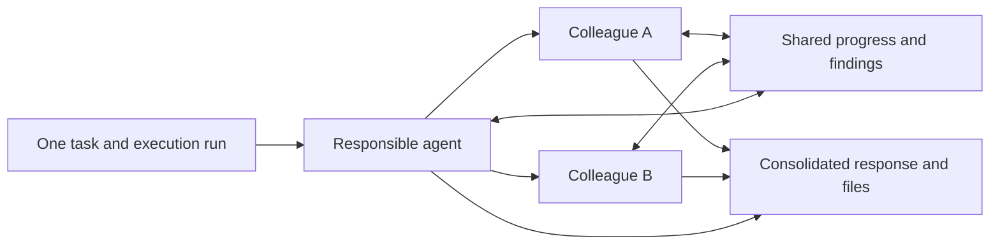

# Reliable research and parallel work on one task

## Behavior

An agent acknowledges only capabilities registered in the worker and allowed
by its settings. Public research requires an actual permitted search and a
sourced answer; an explicit report also requires a document. One correction
turn runs inside the existing graph when the model omits that work. A missing
result, denied tool, provider failure or empty promise cannot complete the task.
An empty search is a valid observation when the response says what was not found.
Public search does not imply access to Google Search Console or private analytics.

An actionable message on an inactive task starts work after the API checks the
comment author, current agent, permissions and credits. Questions remain chat.
The triggering comment is recorded once, and all start paths lock the task to
avoid duplicate executions. Late responses cannot undo a user's Stop action.

The lead agent may delegate up to three independent contributions to available
workspace colleagues. Each runs with its own persona, knowledge scope and
conversation while the lead continues working. Team members share scoped
messages and read progress and results from a common notebook. These exchanges
are also posted under their names in the task conversation; tool activity uses
unique participant IDs within the original run.

The lead collects every contribution and consolidates the final response and
files. Missing or failed contributions prevent a successful close; existing
files remain available. Cancellation drains all running participants. Completed
contributions, messages, evidence and usage are saved for recovery, and only
unfinished internal work is relaunched after a worker restart.

## Decision: integrate contributions into the existing run

The existing API queues whole missions and supports dependency waves for
separate deliverables. A consultation previously generated a short opinion;
it did not execute tools. Parallel contributions extend the worker without
creating separate top-level tasks or a second task lifecycle.

Participants have an explicit list of internal research and production tools.
Their restrictions intersect with the lead's restrictions. They cannot borrow
MCP credentials, recursively delegate, update the task or perform external
actions. Approvals and final status remain the lead's responsibility. Token and
image usage are aggregated into the run; tool activity updates are serialized
in the API so simultaneous callbacks cannot erase each other.

Availability is a dispatch-time snapshot, not a global reservation of a
colleague's queue across independent missions. The maximum team size, graph
step limit, participant timeout and update quota bound work and cost. A worker
restart can repeat unfinished internal generation; completed contributions are
restored without repeating their tools. This is intentionally limited to
reversible internal work. Resume requires configured worker persistence.

Simple missions remain solo. Research plus its report is one mission, including
SEO reviews of an existing website; it does not implicitly request building a
website. Existing explicitly separate creation deliverables still use the
composite orchestrator.

## Rollout and verification

Apply API migration `20260925131000_add_task_comment_ai_receipts.exs` before
deploying the API and worker together. No frontend migration is required:
the existing task conversation, activity timeline and Files view display team
work and deliverables.

Regression coverage exercises fake model/tool boundaries without paid provider
calls: omitted research and one repair, citations beyond the previous summary
limit, empty/malformed results, denied tools, report export, concurrent team
work, scoped permissions, exchange of findings, cancellation, partial failure,
restart recovery, persistence ordering, comment authorization and replay safety.
Real provider availability and production rollout are separate operational checks.
