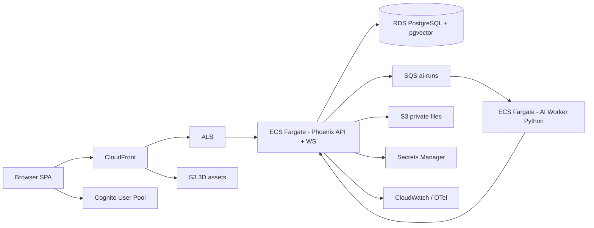

# Architecture

mokaid is an "AI Workforce OS": a workspace where human members and AI agents collaborate on tasks, visualized in a real-time 3D office.

## System overview

## Components

| Component | Stack | Responsibility |
|---|---|---|
| `apps/web` | React, TypeScript, Vite, Babylon.js, TanStack Router/Query, Zustand, Tailwind | SPA + 3D office, realtime UI |
| `apps/api` | Elixir Phoenix, Ecto, Oban, Channels/Presence | REST JSON API, WebSockets, business rules, permissions, jobs |
| `apps/ai-worker` | Python, FastAPI, LangGraph | AI agent execution, tool calls, human-in-the-loop approvals, ingestion |
| `packages/design-tokens` | CSS variables + TS | Single source of truth for the visual identity |
| `packages/shared-types` | TypeScript | Shared statuses, events, channel topics |

## Key flows

### Task execution by an AI agent

1. User clicks "Run with AI" → `POST /api/.../tasks/:id/run`.
2. Phoenix creates a `task_execution_run` and dispatches to the worker (HTTP in dev, SQS in prod).
3. The worker plans steps; each tool call is risk-scored. HIGH/CRITICAL tools pause the run and create an approval request via callback.
4. Phoenix broadcasts `run.waiting_approval` on the workspace channel; UI shows the approval card.
5. Approval decision → `POST /runs/:id/resume` on the worker → run continues → `complete` callback → broadcast → UI updates, avatar switches to `celebrating`.

### Realtime

- One Phoenix socket per session; channels: `workspace:{id}`, `task:{id}`, `agent:{id}`, `notifications:{user_id}`.
- Presence tracks online members; agent status events are broadcast as compact payloads and the client invalidates TanStack Query caches.

### Data isolation

Every query is scoped by `workspace_id` (enforced by the `WorkspaceScope` plug + context functions). Roles/permissions checked in `Mokaid.Permissions`.

## Environments

- **local** — docker-compose: Postgres+pgvector, MinIO, optional ClickHouse, all 3 apps.
- **dev / staging / production** — full AWS via Terraform (see `docs/AWS_INFRASTRUCTURE.md`).
