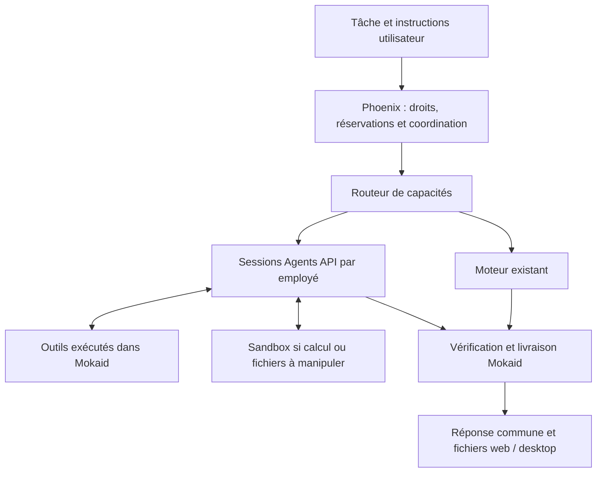

# Agents API dans Mokaid — implémentation du 25 septembre 2026

L’intégration est présente dans le code et **désactivée par défaut**. Aucun déploiement ni lancement payant d’une session fournisseur n’a été effectué pendant cette implémentation.

## Ce qui fonctionne

| Domaine | Comportement implémenté |
| --- | --- |
| Routage | Sélection selon les capacités demandées, y compris la dernière instruction utilisateur. Le moteur existant reste disponible. Une exécution distante déjà commencée conserve son identité lors d’un changement de configuration. |
| Sessions | Adaptateur Python `beta.agents`, sessions distinctes par employé, reprise depuis les ressources canoniques, remplacement d’un environnement expiré à partir des résultats sauvegardés. Sous-agents natifs désactivés. |
| Coordination | Responsable et trois collègues maximum, carnet commun persistant, messages attribués, références Drive, contributions parallèles et réponse consolidée. Les contributions manquantes empêchent une clôture réussie. |
| Autorité | Phoenix vérifie le workspace, l’employé, les droits, les connecteurs et les approbations. Les identifiants MCP sont actualisés à chaque appel et restent dans les transports Mokaid. |
| Durabilité | Admission HTTP/SQS enregistrée avant acquittement, bail exclusif par worker, commandes persistantes, webhooks signés et dédupliqués, journal des opérations indépendant de la session fournisseur. |
| Crédits | Réserve atomique de 500 ou 2 000 crédits pour toute la mission, arrêt à 80 % de l’estimation, rallonge explicite de 500 ou 2 000 crédits, remboursement de la réserve inutilisée et débit plafonné. |
| Arrêt | Annulation de tous les participants, confirmation de l’arrêt des sessions et tours, sauvegarde des fichiers publiés puis comptabilité. Une annulation non confirmée conserve la réservation et est réessayée. |
| Livraison | Sources de recherche, commandes réellement exécutées, vérification des formats et import des fichiers dans Mokaid. La livraison finale possède un reçu durable et un commentaire idempotent. |
| Interfaces | Web et desktop affichent participants, progression, vérifications, livrables et crédits estimés ; les deux permettent la rallonge. Le consentement se règle côté administrateur web. |
| Rétention | Suppression après livraison confirmée lorsque la consommation est disponible ; nettoyage des sessions abandonnées après sept jours, avec sauvegarde préalable et conservation locale des rapprochements incomplets. |

Les relances par commentaire reprennent la même exécution autorisée. Un commentaire ne remplace ni une rallonge de budget ni l’approbation d’une action sensible.

## Contrats et limites explicites

- Le SDK est épinglé à `openai==3.19.2`, avec `langchain-openai==1.6.6` compatible avec le moteur existant.
- Les coûts sont des estimations versionnées, avec tarifs prudents pour le contexte et le cache, coûts des outils instrumentés et provision de calcul. Ils ne constituent pas la facture fournisseur. La consommation inconnue est affichée comme indisponible et reste à rapprocher.
- Le plafond utilisateur reste fixe même si des compteurs fournisseur retardés entraînent un dépassement côté fournisseur.
- Une action externe dont le résultat est incertain est suspendue pour rapprochement ; une nouvelle session ne permet pas de la rejouer automatiquement.
- Seuls les fichiers sauvegardés dans Mokaid ou publiés par le fournisseur sont récupérables. Les fichiers temporaires non publiés d’un environnement expiré ne sont pas garantis.
- La taille par fichier est limitée par défaut à 32 Mio pour que le transfert base64 respecte la limite HTTP de Phoenix. Le réseau du sandbox est désactivé, sauf domaines explicitement configurés.
- La politique d’activation expose le traitement aux États-Unis et l’absence de Zero Data Retention. L’API ne donne aucun accès implicite aux comptes privés.

La tarification et les contraintes fournisseur ont été confrontées aux [tarifs officiels](https://developers.openai.com/api/docs/pricing), à la [documentation Agents API](https://developers.openai.com/api/docs/guides/agents-api/overview) et aux types du SDK installé.

## Validation locale

Les tests couvrent les appels d’outils, trois collègues simultanés, les secrets filtrés, les approbations, les doublons, les pertes de réponse, l’arrêt avant reprise, le budget partagé, l’expiration du sandbox, la reprise par commentaire et les livrables partiels. Un test vérifie qu’un ancien message final ne peut pas être livré comme réponse d’un nouveau tour dont les items ne sont pas encore disponibles.

Les tests PostgreSQL utilisent un schéma temporaire isolé. Les tests API vérifient aussi la facturation, les permissions, les reprises et le relais webhook public. Les suites UI vérifient l’affichage et la rallonge, y compris les erreurs réseau et le réemploi du même identifiant de tentative.

Les tests locaux utilisent un fournisseur simulé ; ils ne remplacent pas les scénarios réels nécessaires avant le pilote. Le détail des commandes et de la matrice de validation se trouve dans [le guide worker](../apps/ai-worker/README.md). Les endpoints, reçus et transitions sont décrits dans [le contrat Phoenix](../apps/api/MANAGED_RUNTIME.md).

## Mise en service

1. Déployer les migrations compatibles : le socle des relances `20260925131000`, puis les migrations runtime `20260925140000`, `20260925141000` et `20260925142000`. Elles ont été exécutées dans l’environnement de test uniquement.
2. Fournir PostgreSQL partagé, les identifiants dédiés API/worker et le secret `OPENAI_AGENTS_WEBHOOK_SECRET`. Configurer le webhook fournisseur vers `/api/webhooks/openai/agents` ; Phoenix relaie le corps signé au worker privé.
3. Exécuter `python -m app.agents.preflight --json`. L’option `--remote` ne fait que des lectures et n’active rien. Le contrôle local actuel valide le SDK mais signale l’absence du secret webhook et l’utilisation du jeton worker de développement.
4. Effectuer les tests internes réels, avec budget autorisé, sur la recherche SEO, les documents, les données, le code, les permissions, la facturation et les interruptions. Confirmer la compatibilité des modèles dans ce projet OpenAI.
5. Renseigner uniquement les modèles validés dans `MANAGED_RUNTIME_VERIFIED_MODELS`, puis activer `OPENAI_AGENTS_ENABLED` et le consentement d’un workspace pilote. Les variables Terraform correspondantes restent à `false`, `[]`, `[]` par défaut.
6. Étendre le pilote après comparaison du coût par tâche réussie, du délai et des livrables vérifiés. Le retour au moteur existant s’applique aux nouvelles missions ; les sessions commencées sont explicitement terminées ou annulées.
