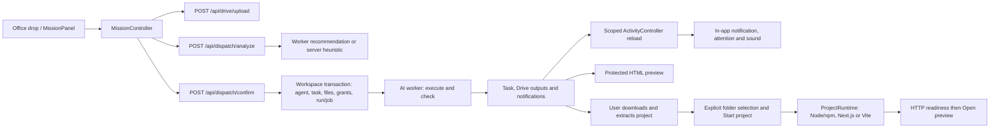

# Desktop missions, file handling and delivery checks

The native desktop now connects the office's file drop and mission brief to the
existing dispatch, Drive and AI-run APIs. A user can review an agent match, create
a proposed specialist, start work and return to its result from a notification.
This is a development implementation; no deployment or public release was made.
Ship the API and worker changes together with the desktop build: launch retry
recovery relies on the API's new idempotency contract. The already-running app
must be restarted to load the rebuilt native interface.

## User flow

1. In a signed-in workspace, choose **New mission**, press **Ctrl/Cmd+N**, or drop
   local files into the office. Opening a mission from an agent preserves that
   agent as the preferred choice. **Resume mission** returns to an existing draft.
2. Describe the outcome and add files by dropping them or using **browse**. The
   brief can be supplied with files, without files, or after a file-only start.
   **Keep for later**, the close button and Escape retain the draft in memory.
3. Choose **Find my agent**. Files upload individually to Drive before the
   dispatcher analyzes the brief and file metadata. Each attachment shows its
   upload state, and a failed file can be retried without re-uploading successes.
4. Review the proposed task and the agent's fit explanation. Choose the suggested
   agent, another available agent, or a proposed new specialist when offered.
   The specialist's name, role and working instructions are editable. An agent
   outside the recommended specialty shows a capability warning. Suggested
   integration grants require selection; they are not silently granted.
5. Choose **Start mission** or **Create & start**. **Follow this mission** opens the
   task. The agent does the work on the server, and the user can continue working.
   An uncertain launch offers **Check launch & retry** to recover the same mission.
6. Open the result from its task or the completion notification. HTML deliverables
   use the existing protected preview. A generated application project can be
   downloaded, extracted and started through **Run a project locally…**.

The draft survives closing the sheet and ordinary connection retries during the
same desktop session. It is not a saved cross-restart draft. Signing out or
switching workspace clears it. Offline users can prepare a brief, but uploads,
analysis and launch require the API connection. A draft also participates in the
app's existing quit/update protection.

## Files: accepted inputs and actual reading capability

The desktop accepts any readable local file extension, with at most **20 files**
and **49,000,000 bytes per file** (49 MB, decimal). Duplicate canonical paths are
ignored; folders should be attached as ZIP archives. The API already has a
**50,000,000-byte request body cap**. The desktop uploads files one at a time and
leaves room below that cap for multipart overhead; this change does not raise the
server limit.

Accepting an attachment means preserving it in Drive. It does not guarantee that
the available tools can interpret its contents.

| Input | Implemented reading path |
| --- | --- |
| PDF, DOCX, XLSX/XLSM/XLS, PPTX and RTF | Dedicated text extractors, subject to parser availability and document readability. |
| Text, Markdown, CSV/TSV, JSON, HTML/XML, YAML and source code | Text decoding and text-model analysis; source is not executed for analysis. |
| ZIP project/source archive | Bounded inventory and readable text entries in memory. No unpacking to disk or code execution. |
| Supported images and rasterizable inputs | Image preparation and vision tools when the required provider capability is configured. |
| Opaque, unsupported or unreadable binary input | Original attachment remains preserved; the run asks for a readable export or a compatible tool. |

Extraction is bounded: up to 800,000 extracted characters, up to 2,000 rows per
spreadsheet sheet, and a 20,000-character excerpt for file-analysis/document-text
tool output. ZIP reading examines at most 200 entries, 1 MB per member and 8 MB
total member bytes. It skips unsafe paths, symlinks, encrypted entries, generated
dependency/build folders and nested binary containers; omitted entries and
truncation are reported. These limits prevent an upload-size allowance from
becoming an unbounded model-context allowance.

For an unreadable attachment, the continuation asks the user to export PDF,
text, CSV, an image, or a ZIP of source files from the original application, or
connect a tool that can read the format. This is a request for usable input, not
a claim that an arbitrary format has been converted successfully.

## ADR: reuse dispatch and separate server work from local execution

**Decision.** Keep mission orchestration in the native application controller,
reuse the server's existing dispatch contract, and keep optional local project
execution in a separate presentation service. QML displays state and forwards
user actions; it does not own authentication, dispatch transactions or jobs.

**Consistency and recovery.** The controller scopes callbacks to the API origin,
user, workspace and credential generation. Workspace changes cancel and discard
the old draft. Credential rotation within the same workspace preserves the draft
and successful uploads while releasing canceled busy operations. Notification
broadcasts trigger a scoped reload; the broadcast title/body is never trusted as
workspace-authorized content.

Confirm sends a UUID `client_request_id`. The API uses a workspace-scoped
transaction lock and request fingerprint to return the existing task/run on an
identical retry and reject a reused ID with different content. Task creation,
optional specialist creation, attachment links, selected grants and run/job
creation share a database transaction. Attachment, project, agent and integration
references are checked in the current workspace. Failure rolls the transaction
back. Already uploaded Drive files remain separate uploads.

**Availability.** Recommendation can use the server's deterministic skill
heuristic when its AI analysis call is unavailable. This still needs an online
API and does not make the desktop an offline AI worker. Mission execution needs
the backend, queue, worker and relevant provider/tool connections to be available.
Server jobs are separate from the desktop process; closing the desktop does not
run them locally or provide operating-system notifications while the app is quit.

The implementation lives in [MissionController](../apps/desktop/application/mission_controller.cpp),
[the API dispatcher](../apps/api/lib/mokaid/ai/dispatcher.ex),
[MissionPanel](../apps/desktop/presentation/qml/MissionPanel.qml) and
[ProjectRuntime](../apps/desktop/presentation/project_runtime.cpp).

## Adaptive execution and bounded QA

[Execution profiles](../apps/ai-worker/app/agents/quality.py) classify effort
locally, without another routing LLM call:

| Profile | Selection | Extra independent review |
| --- | --- | --- |
| Direct | Brief under 300 characters, at most one attachment, and no website/document or complex-task signal | None; focused execution and self-check, graph recursion limit 60. |
| Standard | Other ordinary work | None; self-check, graph recursion limit 100. |
| Deep | Web application, recognized complex-task terms, at least three attachments, or brief over 1,200 characters | Evidence review, at most one repair, then one final review; graph recursion limit 100. |

Deep classification takes precedence over the direct shortcut. These are
heuristics, not a guarantee that every task's difficulty is understood. Direct
work avoids the independent reviewer and mission-memory consolidation overhead;
no latency or token-cost benchmark is claimed.

The [deep runner](../apps/ai-worker/app/agents/deep_runner.py) supplies the reviewer
with the brief, attachment names, bounded deliverable excerpts, recent tool
outcomes and the closing message. The reviewer is a separate model call, not a
second runtime that automatically builds or browses generated apps. It flags
concrete omissions, unresolved failures and unsupported completion claims. It is
instructed to treat source/tool content as untrusted and to distinguish generated
source, static HTML, running applications and actual test evidence.

The maximum extra loop is two reviews and one repair. Repair feedback forbids
repeating successful external side effects. If the final review still requires
changes, the run fails with its findings and keeps partial artifacts available.
A reviewer outage is recorded as `unavailable` rather than inventing a pass or
discarding valid outputs. A tool asking for a readable input pauses the mission.
A `passed` evidence review means the inspected evidence is consistent; it does
not certify unseen code or every possible input.

The design adapts the feedback loops, observable application behavior and
repository-local evidence described in OpenAI's
[Harness engineering](https://openai.com/index/harness-engineering/).
Separating generation from evaluation follows the specific evaluator pattern in
Anthropic's [Harness design for long-running application development](https://www.anthropic.com/engineering/harness-design-long-running-apps).
Here those ideas are intentionally bounded by task complexity and one repair.
The articles support those engineering choices, not a claim that this app uses
the best model, reproduces their results or has passed their benchmarks.

## Notifications and previews

While the app is running, fresh unread task completion, failure, input-needed and approval
events can produce a 14-second in-app notification with **View result** or
**View mission**, system window attention, and the platform alert sound on macOS
or Windows. **Desktop preferences → Play a sound when a mission finishes** stores
the sound preference. Events are deduplicated and filtered for the active
workspace; historical notifications are not replayed as fresh completion alerts.
This implementation does not register a background OS push-notification service.

HTML deliverables open through the existing isolated WebEngine preview and its
resource policy. Viewing HTML is not evidence that a generated Next.js/Vite
project has installed, built or passed functional tests.

For a local application, use the account menu's **Run a project locally…**,
choose the extracted folder containing `package.json`, then choose **Start
project**. Node.js and npm must already be installed. The manifest must include
a `dev` script and a Next.js or Vite dependency. Dependency installation is an
explicit checkbox; starting executes the chosen project's scripts on the user's
computer. Generated output is never started automatically.

The runtime uses `npm ci` when a lockfile exists or `npm install` otherwise, then
starts the dev script on `127.0.0.1:3000`. It reports a port conflict, bounds
installation to five minutes and startup to 90 seconds, retains bounded process
output, and enables **Open preview** only after an HTTP 2xx/3xx readiness response.
The preview opens in the system browser. This confirms server readiness, not
application correctness. The subprocess receives a restricted environment
without inherited desktop API/provider credentials; it is not an OS sandbox.
Stop, sign-out, workspace changes and desktop exit stop the owned process tree.

## Native design and verification evidence

The mission sheet extends the desktop's existing `Theme.qml`: Manrope, violet
primary/selection states, dark surfaces and shared controls. The brief, match
and started states use progressive disclosure, visible attachment status, a
single primary action and a scrollable body at compact window sizes. Keyboard
focus returns to the invoking control, Escape preserves the draft, and
Ctrl/Cmd+Enter advances or launches. Status/error text and icon controls include
accessible names or alert roles. The unrelated web `DESIGN.md` and
`.impeccable/design.json` are outside this native feature's design scope.

The native QML fixture exercises typing a brief, a real Qt drag/drop event,
upload/recommendation transitions, custom-agent editing, offline action disabling
and launch against a loopback test API. Its five captures use synthetic data and
are labelled **INTERFACE TEST · SYNTHETIC DATA**. They are native interface
evidence, not evidence of a live customer mission or production backend run:

- [Brief with attachment](../artifacts/desktop-missions/mission-brief.png)
- [Agent match](../artifacts/desktop-missions/mission-match.png)
- [New specialist](../artifacts/desktop-missions/mission-new-agent.png)
- [Compact layout](../artifacts/desktop-missions/mission-compact.png)
- [Mission started](../artifacts/desktop-missions/mission-started.png)
- [Local project controls](../artifacts/desktop-missions/project-preview.png) (synthetic project; no code started by this UI test)

Recorded checks: the initial API run passed 37 tests; after adding input-needed
notifications, 33 related API tests passed, including four new progress scenarios.
The worker suite passed 149 tests and Ruff; the 26 affected runner/delivery tests
and Ruff passed again after forwarding the input question to the API. The native
mission executable passed 11 QtTest checks, and the local project runtime passed
12 (10 runtime scenarios plus initialization/cleanup). The QML fixture passed
four QtTest checks (an integrated drag/drop-to-launch scenario, a project-sheet
check that verifies opening it does not execute code, and initialization/cleanup).
The desktop application and all test executables compile, and dependency-boundary
and whitespace checks pass. The independent visual review marked all four listed
findings resolved; its verdict applies to that fix list, not full-product acceptance.
The ten affected CTest suites (HTTP transport, mission controller, office,
activity, feature contracts, feature QML, preview policy/navigation, mission QML,
and local runtime) pass across the final run and targeted retests. The preview
navigation fixture was updated to include its icon dependency, and its dialog
title/content sizing was corrected after that test exposed an existing binding loop.
These checks do not establish Windows hardware acceptance, a live paid-provider
mission, background OS notification delivery, or production deployment.
